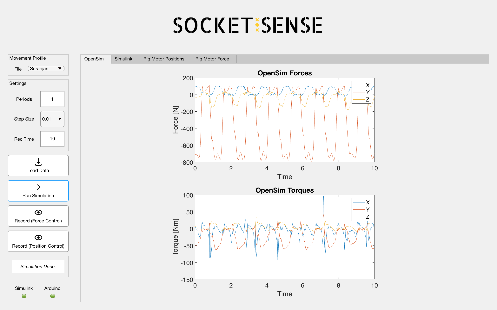
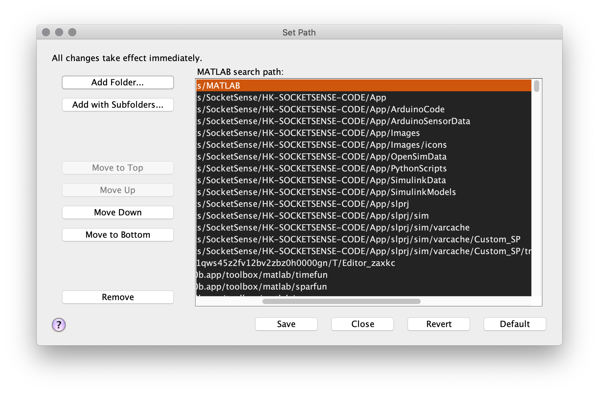

# HK-SOCKETSENSE-CODE
This is the github-repo for SocketSense HK 2020 Project.

## How to use MATLAB GUI
1. Open MATLAB (v.2020b is needed), add folder App to MATLAb search path
by opening `Set Path` and choose `Add with Subfolders..`

Set current working directory to App.

2. Open `Initialize.m` and run script.
_This might not work for Win/Linux since the GUI has only been tested for_
_MacOSX. In that case set the path to the_
_python3 executable in the first line of the script._

`pyenv("Version", "path/to/python")`

_Also install packages mat4py and pyserial with pip3_

3. Open `SocketSenseMainApp.mlapp` and run the App.

4. Click on _Load Data_ to load OpenSim-data
5. Click on _Run Simulation_ to run Simulink simulation with the selected
OpenSim-data. The output force-data from Simulink-model is stored in .mat-file 
under `/SimulinkData`. 

This mat-file can be opened in MATLAB, stored as a .txt-file and saved as a
.h- file using the `convert.py` script in `/PythonScripts`

### Record sensor data
Sensor-data from Arduino is sent via serial communication to the computer.
This data can be recorded, visualized and stored as .mat file using the GUI.
-  Click on _Record (Position Control)_ if position control is running on 
the Arduino to record posiiton data
- Click on _Record (Force Control)_ if force control is running on 
the arduino to record position data

